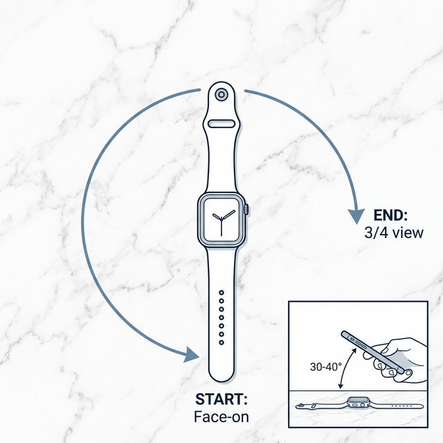

# HRVSpark Watch Video — Filming Guide

Precise instructions for filming an Apple Watch on white marble to create a premium scroll-driven website with the `creating-video-websites` skill.

---

## 🎬 The Shot

**What we're making:** A slow, cinematic orbit around your Apple Watch sitting on white marble. The skill will extract ~200 WebP frames, strip the marble background via AI (`rembg`), and render the watch floating over a dark website that users scrub through by scrolling.

---

## 📋 Pre-Film Setup

### 1. Watch Face
- **Use the complication** — show HRVSpark's sparkline complication live on the watch face. This is the hero of your app.
- Pick a watch face that keeps the complication prominent and readable (e.g., Modular Compact, Infograph Corner).
- **Screen always-on**: Go to Settings → Display & Brightness → Always On → enable. This prevents the watch dimming mid-shot.
- **Disable raise-to-wake gestures** if possible — you don't want the screen shifting states while you film.

### 2. The Marble Surface
- **Clean it** — wipe down with a microfiber cloth. Any dust or smudge is amplified at close range.
- **White/light marble is ideal** — `rembg` will strip it cleanly. Avoid very dark or heavily veined marble (confuses the AI boundary detection).

### 3. Watch Placement
- Lay the watch **flat on the marble**, crown facing right (standard product photography orientation).
- If the band is distracting, consider removing it or tucking it under — the focus should be the watch face and case.
- Alternatively: drape the band naturally in a slight curve for a lifestyle feel, but keep it **within the frame** throughout the orbit.

---

## 📱 Camera Settings (iPhone)

### Resolution & Frame Rate
| Setting | Value | Why |
|---------|-------|-----|
| **Resolution** | 4K | Maximum detail for frame extraction (auto-capped at 1920px wide) |
| **Frame rate** | 24fps or 30fps | Cinematic feel; the script will downsample to ~10-15fps anyway |
| **Format** | MOV or MP4 | Both work with OpenCV |

> **How to set:** Settings → Camera → Record Video → 4K at 24fps.

### Focus & Exposure
- **Tap-and-hold** on the watch face before recording to lock focus and exposure (AE/AF Lock).
- This prevents the camera hunting for focus or shifting exposure as you orbit.

### Zoom
- **Stay at 1× optical** — no digital zoom. You'll crop in post if needed.

---

## 🎥 The Filming Technique

### Duration
**Target: 8-12 seconds.** This extracts to ~150-250 frames at 15fps — the sweet spot for scroll feel.

| Duration | Frames at 15fps | Scroll Feel |
|----------|----------------|-------------|
| 6s | ~90 | Too fast, feels rushed |
| **8-10s** | **~150-200** | **✅ Premium, deliberate** |
| 12s | ~250 | Rich but heavier page load |
| 20s+ | 300+ | Overkill, sluggish load |

### Movement: Slow Semi-Orbit (Step-by-Step)

Think of the watch as a clock face lying flat on the table. The crown (side button) points to **3 o'clock**. You're going to slide from the **6 o'clock** position to roughly the **3 o'clock** position.

#### Setup: Find Your Starting Spot

1. **Stand at the table edge** closest to the **bottom of the watch band** (the 6 o'clock side). You're looking straight down at the watch from this edge.
2. **Hold your phone about 10 inches above the table**, aimed toward the watch. Tilt the phone so the camera points **down at the watch at an angle** — not straight down like a bird's-eye view, and not level like a selfie. Imagine your phone is a ramp: the top of the phone tilts slightly away from you, the bottom tilts toward you. The screen should show the full watch face nicely, with some marble around it.
3. **What you see on screen:** The watch face fills maybe 40-50% of the frame. You can read the time and see the complication clearly. The band extends toward the top and bottom of the frame. Some white marble is visible all around.

#### The Movement

4. **Hit record.** Hold still for ~1 second (gives a clean starting frame).
5. **Slowly slide to your right** along the table edge. Your body moves — your arms stay in roughly the same position relative to your chest. The watch stays centered on screen the whole time.
6. **As you slide right**, you'll naturally start seeing the crown/side of the watch case come into view on the right side of the screen. This is good — you're revealing the 3D shape.
7. **Stop** when you've moved about 2-3 feet to your right along the table edge. On screen, you should now see a **three-quarter view**: the watch face is visible but angled, and the crown and side edge of the case are clearly showing.
8. **Hold still for ~1 second**, then stop recording.

#### What "Too Far" Looks Like
If you can barely see the watch face anymore and you're mostly looking at the side of the case — you've gone too far. Pull back to where the face is still the star, with the side adding depth.

#### Speed
Count "one-Mississippi, two-Mississippi..." up to 8-10 during your slide. That's the pace. If it feels awkwardly slow, you're doing it right.

### Stabilization: The "Elbow Pivot" Trick

You don't need a tripod. Here's how to get smooth footage handheld:

1. **Place a folded towel** on the table edge in front of you.
2. **Plant both elbows** on the towel, about shoulder-width apart.
3. **Hold the phone in both hands**, elbows down, forearms forming a triangle.
4. **To orbit:** keep your elbows planted and slowly slide them along the towel to your right. Your elbows act like a dolly track — the phone stays incredibly stable because your forearms absorb all the micro-shakes.

If you lift your elbows or move from the shoulder, you'll get wobble. Keep those elbows pinned.

### Do's and Don'ts

| ✅ Do | ❌ Don't |
|-------|---------|
| Slide your whole body along the table edge | Twist at the waist or swing your arms |
| Keep the watch centered on screen at all times | Let the watch drift to the edge of frame |
| Breathe out slowly as you move (steadies hands) | Hold your breath (causes micro-tremors) |
| Keep ~10 inches from the watch | Get closer than 6 inches (camera hunts for focus) |
| Film 3-4 takes and pick the smoothest | Assume take 1 is good enough |

---

## 💡 Lighting

### The Goal
Even, diffused light with **no harsh reflections on the watch glass**.

### Best Setup (In Order of Preference)
1. **Window light (overcast day):** Place the marble near a large window. Overcast = giant natural softbox. Position the watch so the window is at ~45° to the front-left.
2. **Window light (sunny day):** Same position, but tape a white sheet or parchment paper over the window to diffuse direct sun.
3. **Desk lamp with diffusion:** If no window, use a desk lamp aimed at a white wall or ceiling to bounce light. Never aim a bare bulb directly at the watch (reflections).

### Avoid
- ❌ Overhead fluorescent/ring lights (green cast, watch glass glare)
- ❌ Multiple colored light sources (confuses `rembg` background detection)
- ❌ Your own shadow falling on the watch

---

## ✅ Quality Checklist (Before You Film)

- [ ] Watch face shows HRVSpark complication with visible sparkline data
- [ ] Always-on display enabled
- [ ] Marble surface is clean and consistently lit
- [ ] AE/AF locked on the watch face
- [ ] Recording at 4K, 24fps or 30fps
- [ ] No notifications will pop up during filming (enable Do Not Disturb)
- [ ] Band is positioned intentionally (removed, tucked, or styled)
- [ ] You've done 1 practice orbit to check framing

---

## 📤 After Filming

1. **Transfer the best take** to your Mac (AirDrop is fastest).
2. Place it somewhere accessible, e.g. `~/Desktop/hrvspark_hero.mov`.
3. Tell me: *"Build the HRVSpark scroll website using the creating-video-websites skill with `~/Desktop/hrvspark_hero.mov`. Remove the background."*
4. The skill will:
   - Extract ~200 WebP frames
   - Strip the white marble via `rembg`
   - Scaffold `index.html`, `css/style.css`, `js/app.js` with GSAP + Lenis
   - Match HRVSpark's dark aesthetic with the watch floating over a premium dark canvas

---

## 🎨 What the Website Will Look Like

The final scroll-driven site will feature:
- **Dark background** (`#0a0a0f` — matching the Filament Labs/HRVSpark aesthetic)
- **Your Apple Watch floating in space**, rotating as users scroll
- **Staggered text sections** entering from alternating sides with different animations
- **HRVSpark brand copy** — "A Window, Not a Verdict", raw data positioning, complication-first messaging
- **Massive typography** (12rem hero) with the Neon Sparkline color palette (blue `#338ef7` / orange `#ff7c1e`)
- **Counter animations** for stats (24hr retention, complication count, etc.)
- **Horizontal marquee** with oversized brand text
- **Lenis smooth scroll** for a native app-like feel
